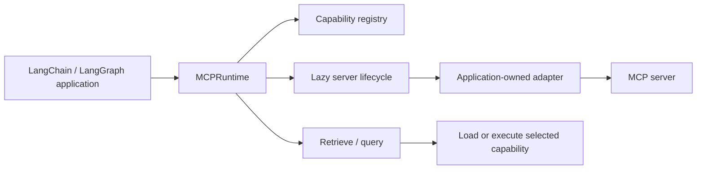
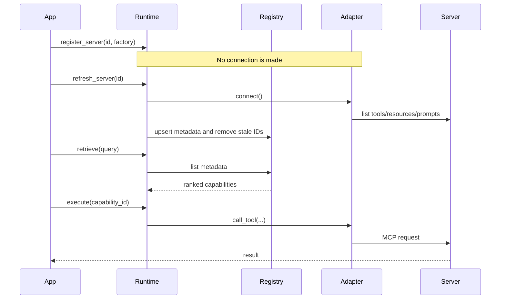

# Architecture overview

Each runtime instance owns its servers, registry, caches, locks, semaphores, and background
tasks. No mutable process-wide singleton is used. Metadata discovery is separate from loading:
many records can remain in the registry while only a handful are selected for an agent.

## Request lifecycle

## Isolation and extension points

* Create one `MCPRuntime` per tenant, agent, or policy boundary; do not share mutable runtimes
  between unrelated applications.
* Pass an implementation of `CapabilityRegistry` when metadata must live in a database or another
  process. The protocol is intentionally small.
* Implement the async adapter shape, or wrap an adapter from `langchain-mcp-adapters`. The router
  never opens a transport itself.
* `retrieve` is deterministic term matching. Applications can apply a model, policy, or graph
  node after retrieval and before execution.
