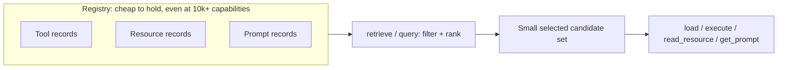

# Concepts

Tools, Resources, and Prompts are routed through the identical retrieve -> select -> load/execute
path as siblings of one `Capability` model -- none of the three is a special case bolted on
afterward. Holding 10,000+ metadata records in the registry stays cheap because retrieval indexes
and filters that metadata; only the handful of capabilities an agent actually selects are ever
loaded or invoked.

## Capabilities

`Tool`, `Resource`, and `Prompt` are immutable capability records. Every record has a stable
`capability_id` (`<server>:<kind>:<name-or-uri>`), `server_id`, `name`, description, metadata,
and availability. Resources additionally have a URI; prompts have argument names; tools may have
an input schema.

## Discovery, retrieval, and execution

* **Discovery** connects and reconciles metadata via a per-server
  [`refresh_engine.RefreshEngine`](https://pypi.org/project/refresh-engine/). It can be explicit
  (`refresh_server`, which accepts `mode=`/`resource_ids=` for `FULL`/`INCREMENTAL`/`TARGETED`/
  `DEPENDENCY_AWARE` reconciliation) or runtime-managed through a per-server `RefreshPolicy`;
  startup remains lazy unless `on_register=True`. See [refresh](../operations/refresh.md) for
  the full reconciliation contract.
* **Retrieval** (`retrieve` or `query`) filters by type/server and ranks matching terms. It does
  not call an MCP capability.
* **Loading** (`load`) resolves a selected capability for an application cache.
* **Operations** (`execute`, `read_resource`, `get_prompt`) connect on demand and invoke the
  corresponding adapter method.

`query(...)` searches existing metadata first. After a miss, it automatically refreshes servers
registered with `RefreshPolicy(on_query_miss=True)`, then searches again. The explicit
`refresh_servers=[...]` hint remains available for one-off query-scoped refreshes.

## Lifecycle and resilience

Registration stores a factory or adapter but does not connect, and builds that server's
`RefreshEngine`. `connect` is idempotent per server, and `reconnect` closes and creates a fresh
adapter. A runtime context manager stops every scheduler and policy task, closes every server's
`RefreshEngine`, then closes adapters, registry resources, and loader caches. `max_concurrency`
bounds operations through the runtime bulkhead.

## Registry contract

`InMemoryRegistry` is the default. A custom `CapabilityRegistry` must implement `upsert_many`,
`remove_missing`, `remove`, `get`, `list`, and `close`. `remove` deletes one capability by ID and
backs incremental/dependency-aware refresh; `remove_missing` stays for bulk reconciliation and
`unregister_server`. Discovery happens outside registry locks, making network latency
independent from metadata lock duration.
