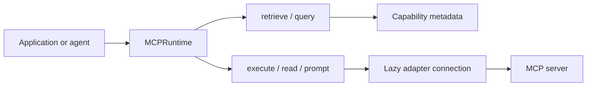

# MCP Capability Router

An async-first, runtime-isolated registry and router for MCP **tools, resources, and prompts**.
The router keeps discovery metadata cheap, selects only relevant capabilities, and connects to a
server only when an operation needs it.

!!! note
    This project owns routing and lifecycle policy, not MCP transports, authentication, model
    calls, or agent orchestration. Those are supplied by your adapter and application.

## Start here

1. Run the [real MCP examples](examples/overview.md), starting with the Filesystem MCP smoke test.
2. Read [Architecture](architecture/overview.md) and [Concepts](concepts/overview.md) before
   choosing a registry.
3. Follow [Getting started](guides/getting-started.md) to connect an application-owned adapter.
4. Use the [API reference](reference/api.md) and
   [Troubleshooting](troubleshooting/overview.md) while integrating.

The real-server examples use local stdio MCP servers and do not require model credentials.
Integration hooks show where `langchain-mcp-adapters`, LangChain, and LangGraph fit.
