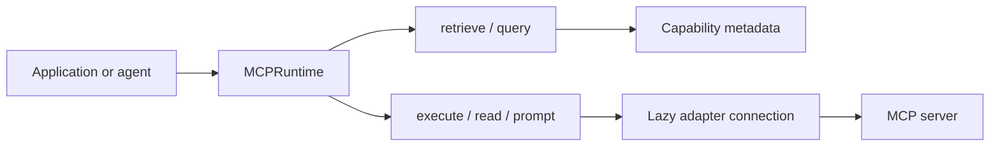

# MCP Capability Router

An async-first, runtime-isolated registry and router for MCP **tools, resources, and prompts**.
The router keeps discovery metadata cheap, selects only relevant capabilities, and connects to a
server only when an operation needs it.

!!! note
    This project owns routing and lifecycle policy, not MCP transports, authentication, model
    calls, or agent orchestration. Those are supplied by your adapter and application.

## Start here

1. Follow [Getting started](guides/getting-started.md) to install the package and run a minimal
   application.
2. Read [Concepts](concepts/overview.md) and [Architecture](architecture/overview.md) to
   understand the capability model and isolation guarantees before choosing a registry.
3. Browse the [examples](examples/overview.md) -- starting with the Filesystem MCP smoke test --
   for runnable code covering real MCP servers, LangGraph/DeepAgents integrations, and pluggable
   backends.
4. Read [Agent Skills](guides/agent-skills.md) for the canonical agent instructions used to
   integrate and debug the runtime with coding agents and IDE tooling.
5. Use the [API reference](reference/api.md) and
   [Troubleshooting](troubleshooting/overview.md) while integrating.

The real-server examples use local stdio MCP servers and do not require model credentials.
Integration hooks show where `langchain-mcp-adapters`, LangChain, and LangGraph fit.
