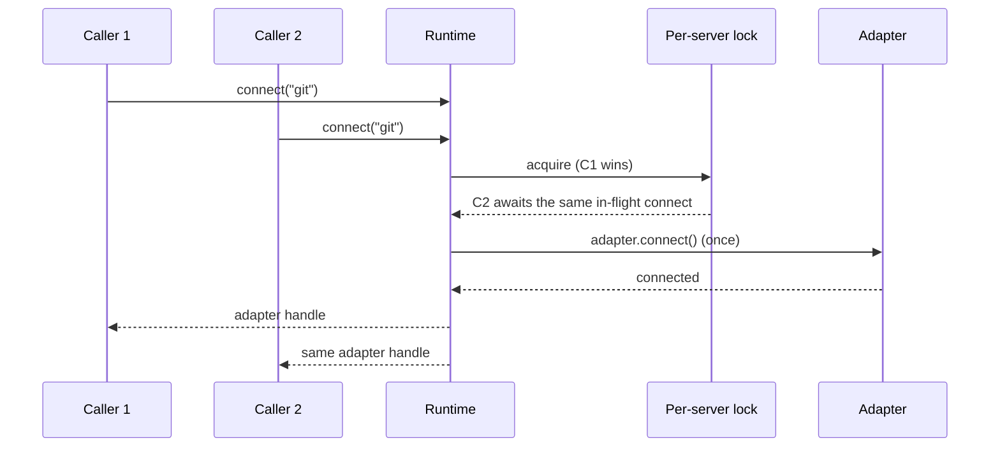

# Concurrency

Refresh coordination collapses concurrent calls the same way: two `refresh_server("git")` calls
await one shared discovery task, while `refresh_server("git")` and `refresh_server("fetch")` run
concurrently since they are keyed by server ID.

## Connection and operation coordination

`connect(server_id)` is idempotent. A server handle uses a per-server async lock so concurrent
callers share one adapter connection instead of creating competing connections.

The runtime's `max_concurrency` setting bounds active `execute`, `read_resource`, and
`get_prompt` calls across that runtime. It does not bound metadata retrieval, `load`, connection,
or discovery. Select a value that matches the capacity and quotas of the application-owned MCP
servers.

## Refresh coordination

Concurrent `refresh_server` calls for the same server await one shared refresh task. Different
servers may refresh concurrently. Discovery occurs before registry writes, so time spent waiting
on a server does not hold a registry lock.

`refresh()` starts a refresh for every currently registered server and waits for them as one
group. If any server refresh fails, the call fails; use individual `refresh_server` calls when
the application needs per-server error handling.

## Shutdown

Use `async with MCPRuntime(...)` or call `close()` during application shutdown. Closing cancels
tracked in-flight refresh tasks before closing adapters and owned registry/loader resources.
Cancellation is not converted into a successful refresh or operation result.
