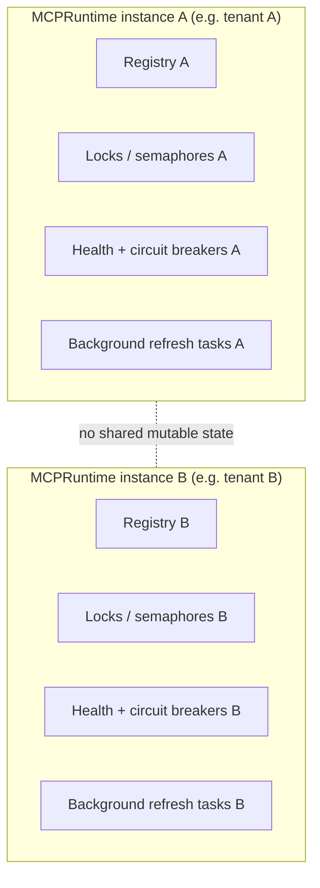

# Isolation and security boundaries

No process-wide registry, breaker, or task exists: everything a runtime uses is owned by that
runtime instance and is torn down when it closes. Two runtimes never observe each other's
capabilities, health, or in-flight work, even when both run in the same process.

## Credentials

The package does not implement authentication. Configure MCP credentials and model credentials in
the application or a secret manager. Do not pass credentials through capability metadata,
descriptions, tags, or prompts.

The repository intentionally contains no live credentials. If a credential is pasted into a
terminal, chat, issue, log, or source file, treat it as exposed and replace it according to the
owning provider's policy.

## MCP server permissions

Filesystem and Git servers can read or modify local data. Use a dedicated directory, least
privilege OS account, and explicit repository allow-list. Review every server command before
running it; the router does not sandbox a subprocess.

## Capability policy

Retrieval is not authorization. Before execution, applications should enforce server, capability,
tenant, user, and argument policy. The selected capability ID and server ID are safe audit
identifiers; raw tokens and authorization headers are not.

## Isolation

Each `MCPRuntime` owns its registry, adapter connections, caches, locks, semaphores, health, and
background tasks. Do not share a mutable runtime across unrelated security or tenant boundaries.

Choose a runtime boundary before registering servers. Closing a runtime cancels its tracked
refresh work, closes its adapters, closes its registry and loader resources, and clears its
server and breaker state. It does not manage resources that the application did not give to an
adapter.
