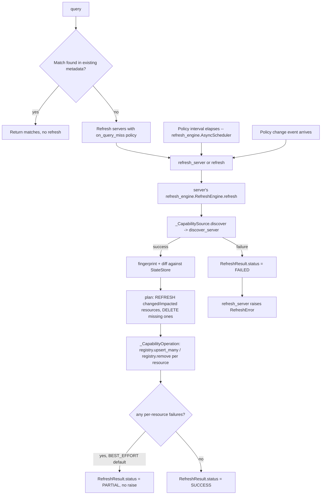

# Refresh and capability reconciliation



Manual, query-driven, event-driven, and time-based refresh all funnel through one
[`refresh_engine.RefreshEngine`](https://pypi.org/project/refresh-engine/) instance per
registered server. `MCPRuntime` builds this engine at `register_server(...)` time, and owns
its policy listeners, `refresh_engine.AsyncScheduler` (for `interval`), and their lifecycle;
applications only declare triggers when registering a server. In-flight-refresh
deduplication, fingerprinting, dependency-aware planning, bounded retries/timeouts, and
transactional state tracking are all `refresh_engine`'s own responsibility now, not
hand-rolled by this project.

## When to refresh

Declare automatic behavior with `RefreshPolicy`:

```python
import asyncio

from mcp_capability_router import MCPRuntime, RefreshPolicy
from refresh_engine import RefreshMode

changes: asyncio.Queue[object] = asyncio.Queue()

async with MCPRuntime() as runtime:
    await runtime.register_server(
        "catalog",
        adapter_factory,
        refresh=RefreshPolicy(
            on_register=True,
            on_query_miss=True,
            interval=300,
            change_events=changes,
            mode=RefreshMode.FULL,  # or INCREMENTAL / TARGETED / DEPENDENCY_AWARE
        ),
    )
```

`on_register` performs initial discovery before registration returns. `on_query_miss` makes
ordinary `query(...)` calls refresh that server automatically after a cache miss. `interval`
starts a runtime-owned `refresh_engine.AsyncScheduler`, and each item from `change_events`
triggers an event-driven refresh. The event source may be an `asyncio.Queue` or any async
iterable. `mode` is the `refresh_engine.RefreshMode` these automatic triggers run under
(`FULL` by default: discover, then reconcile against the last known state).

Registration is lazy when no policy is supplied: `MCPRuntime` builds a `RefreshEngine` for
every registered server, with no automatic triggers attached until one is configured.
`refresh_server`, `refresh`, and `query(..., refresh_servers=[...])` give an application
explicit, one-off control, and accept `mode=`/`resource_ids=`:

```python
from refresh_engine import RefreshMode

# Full reconciliation (the default): re-touch every currently known capability and
# delete any that discovery no longer reports.
await runtime.refresh_server("catalog")

# Only process capabilities that actually changed since the last refresh.
await runtime.refresh_server("catalog", mode=RefreshMode.INCREMENTAL)

# Only refresh specific capability IDs.
await runtime.refresh_server(
    "catalog", mode=RefreshMode.TARGETED, resource_ids={"catalog:tool:search"}
)

# Refresh whatever changed, plus every capability that depends on something that changed
# (via Capability.depends_on / the `dependencies` field returned by an adapter).
await runtime.refresh_server("catalog", mode=RefreshMode.DEPENDENCY_AWARE)
```

## Reconciliation contract

A refresh connects through the application's adapter, lists capabilities, fingerprints them
(`refresh_engine.CompositeHash`, which canonicalizes the `Capability` dataclass directly with
no manual serialization), and diffs the result against the last known state. `REFRESH` actions
call `registry.upsert_many([capability])` one capability at a time; `DELETE` actions -- issued
for tracked capabilities discovery no longer reports -- call `registry.remove(capability_id)`.
`CapabilityRegistry` implementations must provide both `upsert_many` and the single-item
`remove`, plus the bulk `remove_missing` used by `unregister_server` (also available directly
to applications).

`refresh_server`/`refresh`/`query` return (or await) a `refresh_engine.RefreshResult`. Its
`status` is one of:

- `SUCCESS` -- everything selected by the requested mode refreshed cleanly.
- `PARTIAL` -- under the default `FailurePolicy.BEST_EFFORT`, some capabilities failed to
  persist (e.g. a custom registry raised) but others succeeded; **this does not raise** --
  inspect `result.errors` for the per-capability detail.
- `FAILED` -- discovery itself failed outright, or a custom `RefreshConfig(failure_policy=
  FailurePolicy.FAIL_FAST)` aborted the whole refresh on the first failure. `refresh_server`
  raises `RefreshError` in this case, wrapping the underlying issue(s), so applications can
  log, retry, or surface it according to their own policy. Discovery completing before any
  registry write also means a discovery failure leaves last-known records untouched.

## Configuring the underlying `RefreshEngine`

`RefreshPolicy.config`/`RefreshPolicy.store` are passed straight through to
`refresh_engine.RefreshEngine(..., config=..., store=...)` for that server. Leaving either as
`None` (the default) means refresh-engine's own recommended defaults apply unmodified --
`RefreshConfig()` (`max_concurrency=10`, `OverlapPolicy.COALESCE`,
`FailurePolicy.BEST_EFFORT`, its own retry/timeout defaults) and an `InMemoryStateStore()`.
Override either to get e.g. fail-fast semantics or a persistent/shared state store:

```python
from refresh_engine import FailurePolicy, RefreshConfig

await runtime.register_server(
    "catalog",
    adapter_factory,
    refresh=RefreshPolicy(
        config=RefreshConfig(failure_policy=FailurePolicy.FAIL_FAST, max_concurrency=4),
    ),
)
```

## Scheduling

`RefreshPolicy.interval` starts a `refresh_engine.AsyncScheduler` for that server;
`unregister_server` stops that scheduler and cancels the server's event task; `close()` stops
every scheduler and cancels every policy task, then closes every server's `RefreshEngine`. A
failed background refresh is logged with its server and trigger, retains last-known registry
records, and does not terminate future interval/event processing.

Choose intervals using server change frequency, credentials, maintenance windows, and quota.

