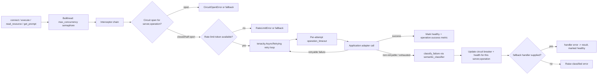

# Resilience

Every runtime operation passes through this same pipeline; only the failure category (from
`semantic_classifier`) determines whether the retry loop and circuit breaker treat it as
retryable.

The resilience package provides runtime-scoped retry, timeout, circuit breaker, rate limiting,
health, and metrics primitives. The `MCPRuntime` constructor exposes `operation_timeout`,
`retry`, `rate_limiter`, and `metrics`; the shared bulkhead is configured by `max_concurrency`.
`retry` and `rate_limiter` accept real `tenacity.AsyncRetrying`/`aiolimiter.AsyncLimiter`
instances directly, built from those libraries' own primitives (`stop_after_attempt`,
`wait_exponential`, `retry_if_exception`, etc.). When omitted, `retry` defaults to a single
attempt (no retry) and `rate_limiter` defaults to no throttling.

## Runtime operation pipeline

Every runtime operation -- `connect`, discovery, `execute` (tool calls), `read_resource`, and
`get_prompt` -- is funneled through a single runtime-owned `OperationPipeline` so the same
guarantees apply uniformly. For each call, the pipeline applies, in order: bulkhead admission
(shared across all operations and servers, bounded by `max_concurrency`), the interceptor
chain, a circuit breaker, optional rate limiting, retry, and an optional per-attempt timeout. A
successful operation marks it healthy; a non-cancellation failure marks it degraded (or
unhealthy once the failure threshold is reached) and emits `operation.start`,
`operation.success`, and `operation.failure` events to the configured `MetricsHook`.

Circuit breakers and health trackers are keyed by `(server_id, operation)`, not by server ID
alone. This means a cached, always-succeeding `connect` never resets the failure count
accumulated by a failing `call_tool` (or vice versa) against the same server: each operation
kind has its own independent failure history. `await runtime.health(server_id)` aggregates the
worst state across that server's tracked operations. `unregister_server` clears the circuit
breaker and health state accumulated for that server ID so a later re-registration starts clean.

The runtime creates a circuit breaker with its default threshold and recovery settings for each
`(server_id, operation)` pair. It does not expose breaker tuning through the `MCPRuntime`
constructor. Use the lower-level resilience components when an integration needs a custom
breaker policy.

## Failure classification

Every retry and circuit breaker decision is driven by `semantic_classifier`, which maps
exceptions to a `FailureCategory` (`connection_failure`, `timeout`, `authentication_failure`,
`authorization_failure`, `rate_limited`, `server_unavailable`, `protocol_failure`,
`invalid_request`, `capability_not_found`, `tool_execution_failure`, `resource_read_failure`,
`prompt_retrieval_failure`, or `unknown`) via `categorize_failure`. Categories that will never
succeed on their own -- authentication, authorization, invalid request, capability-not-found,
and protocol failures -- are never retried and never keep a circuit half-open probing; every
other category (including plain, uncategorized exceptions) is retried according to the
configured `retry` (or not retried at all, if `retry` is omitted).
Cancellation, `KeyboardInterrupt`, and `SystemExit` are never retried or classified.

Use `classify_failure(error)` directly to get a `FailureClassification(retryable, reason,
category)` for logging or custom routing, and raise the package's semantic error types
(`AuthenticationError`, `AuthorizationError`, `ToolExecutionError`, `ResourceReadError`,
`PromptRetrievalError`, `ServerUnavailableError`, `ProtocolError`, `InvalidRequestError`) from a
custom adapter so the pipeline classifies its failures correctly instead of falling back to
`unknown`.

## Fallback

`OperationPipeline.run(..., fallback=handler)` and the standalone `with_fallback(operation,
handler)` / `FallbackPolicy` helpers let a caller supply `handler(error) -> result` to serve a
degraded response -- a cached value, a default, a synthetic result -- instead of propagating a
failure once retries and the circuit breaker have been exhausted. A successful fallback call
still records `operation.success` and marks the operation healthy, since the caller received a
usable result. Fallback never intercepts cancellation.

## Retries and timeouts

`retry` accepts a real `tenacity.AsyncRetrying` instance; when omitted, the pipeline makes a
single attempt (no retry). Build one from `tenacity`'s own primitives -- for example
`AsyncRetrying(stop=stop_after_attempt(3), wait=wait_exponential(...),
retry=retry_if_exception(semantic_classifier), reraise=True)` -- for exponential backoff,
jitter, or a custom retry predicate. Cancellation, keyboard interrupts, and process-exit
signals are never retried, and neither are the non-retryable failure categories described
above -- compose your `retry` predicate with `semantic_classifier`, or an equivalent check, to
preserve this.

`operation_timeout` applies to each attempted adapter operation. Set it to a positive value
based on the selected server and transport. A timeout raises the package `TimeoutError`; it is
not a successful fallback unless a `fallback` handler is supplied.

## Rate limits, health, and metrics

`rate_limiter` accepts a real `aiolimiter.AsyncLimiter` shared by the runtime's operations; when
omitted, no throttling is applied. It is not a per-server limiter. Build one directly, e.g.
`AsyncLimiter(max_rate, time_period=...)`, for the desired burst capacity and time period.
`await runtime.health(server_id)` returns the runtime handle state, not an external server
health check.

Pass a `MetricsHook` to the `MCPRuntime` constructor to observe every operation the pipeline
runs. Application hooks should emit operation names and server identifiers without recording
credentials, authorization headers, or raw tool arguments.